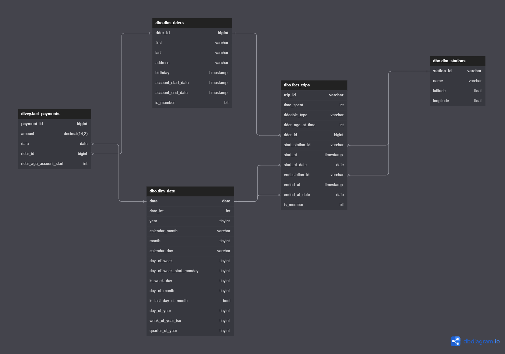

# Udacity - Azure Data Engineering - Azure Databricks

The goal of this project is to develop a data lake solution using Azure Databricks using a lake house architecture. You will:

- Design a star schema based on the business outcomes listed below;
- Import the data into Azure Databricks using Delta Lake to create a Bronze data store;
- Create a gold data store in Delta Lake tables;
- Transform the data into the star schema for a Gold data store;

# Build and Test

- python -m venv .venv
- source .venv\Scripts\activate
- pip install -r dev-requirements.txt
- download java 8 and add JAVA_HOME to env variables
- download hadoop binaries, add HADOOP_HOME to env variables and %HADOOP_HOME%\bin to PATH
- use ***databricks-connect configure*** to configure the cluster to be used
- run scripts on virtual env as module: python -m bronze.test_script

## Scripts

The scripts are separated by the layers bronze, silver and gold. Every layer is a folder and python module.

## ER Diagram

## Bussines Outcomes

The business outcomes you are designing for are as follows

1. Analyze how much time is spent per ride
    - Based on date and time factors such as day of week and time of day
    - Based on which station is the starting and / or ending station
    - Based on age of the rider at time of the ride
    - Based on whether the rider is a member or a casual rider
2. Analyze how much money is spent
    - Per month, quarter, year
    - Per member, based on the age of the rider at account start
3. EXTRA CREDIT - Analyze how much money is spent per member
    - Based on how many rides the rider averages per month
    - Based on how many minutes the rider spends on a bike per month